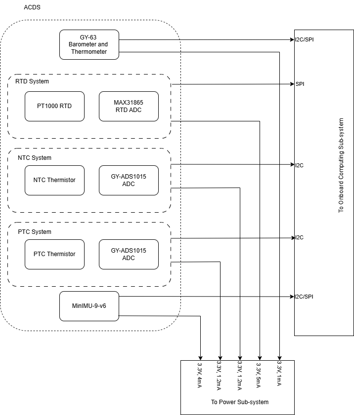

# 🛰️ Attitude Determination & Control Subsystem (ADCS)

Welcome to the ADCS team! We’re responsible for one of the most critical parts of satellite operation: **knowing where we are pointing — and making sure we stay pointed in the right direction**. Whether it's ensuring cameras are aimed at Earth or antennas at a ground station, our work directly supports mission success.

---

## 🌌 What We Do

As part of the ADCS group, you’ll dive into:

- Measuring satellite orientation using inertial and environmental sensors  
- Calculating real-time attitude using sensor fusion algorithms  
- Enabling active and passive control of satellite attitude  
- Testing and calibrating sensors for high-altitude and space-like environments  

Accurate attitude determination ensures all other subsystems — from communication to imaging — perform optimally.

---

## 🔧 Technologies & Tools You’ll Work With

We use a variety of precision sensors and modules to determine and maintain orientation:

- **Barometric & Temperature Sensors**: Measure atmospheric pressure and ambient temperature to aid in altitude estimation and thermal analysis.  
- **RTD (Resistance Temperature Detectors)**: High-accuracy temperature sensors for thermal modeling and calibration.  
- **RTD ADC Modules**: Interface analog RTD signals with digital systems for precise temperature monitoring.  
- **Thermistors (PTC & NTC)**: Compact temperature sensors used for real-time thermal protection and environment sensing.  
- **IMUs (Inertial Measurement Units)**: Combine accelerometers, gyroscopes, and magnetometers to determine orientation and motion in 3D space.  
- **External ADCs**: Extend analog-to-digital conversion capabilities for various sensor inputs.  

---

## 🧠 Skills You'll Develop

- Inertial Measurement Unit (IMU) integration and calibration  
- Sensor fusion using accelerometer, gyroscope, and magnetometer data  
- Working with ADCs and temperature sensors in precision applications  
- Hands-on experience in both embedded software and signal processing  

---

## 🚀 Why Join?

Whether you're passionate about embedded systems, aerospace engineering, or sensor technology, ADCS offers a deep dive into:

- Applying physics and math to real-world space systems  
- Building and testing flight-ready hardware  
- Collaborating with other subsystems to achieve stable, accurate orientation  
- Working on a mission-critical system that determines success or failure in space  

Together, we keep the satellite on track — literally.

